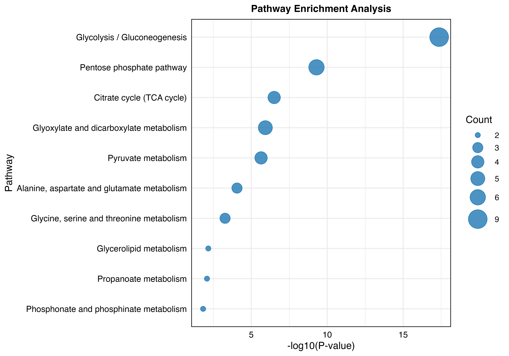
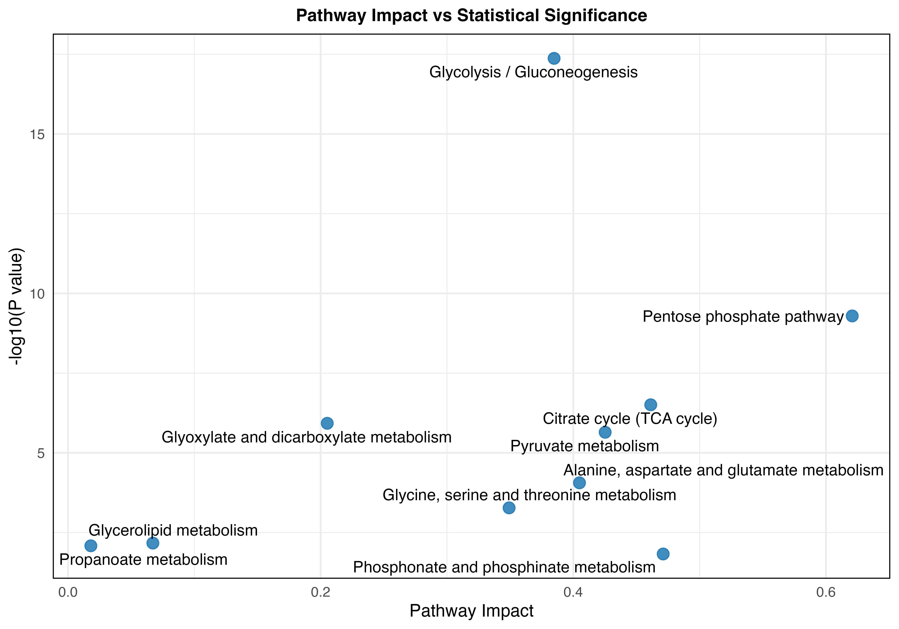
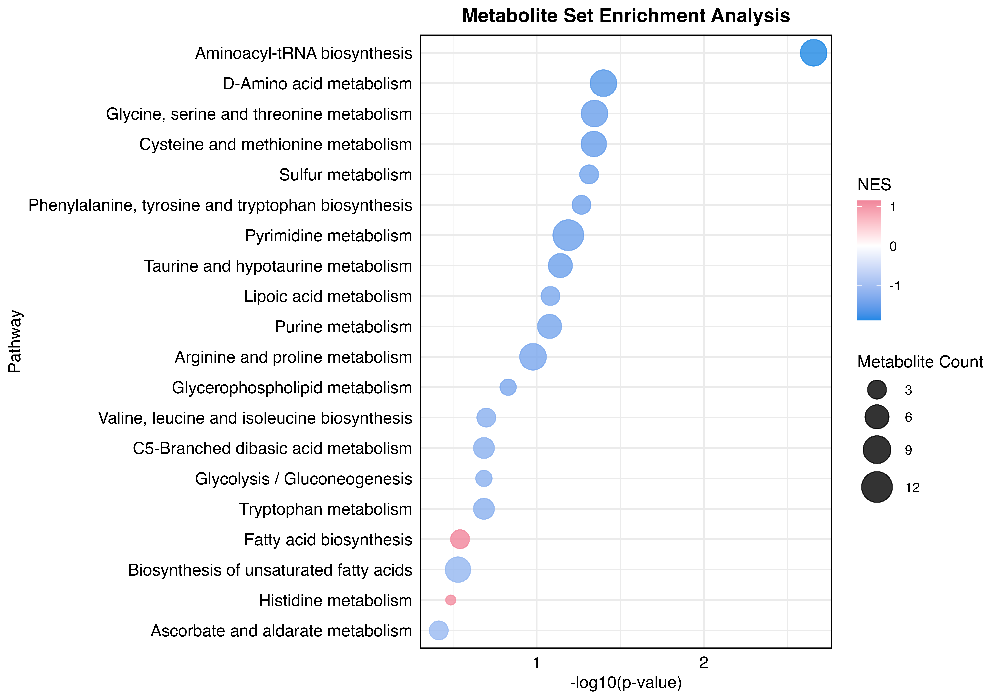
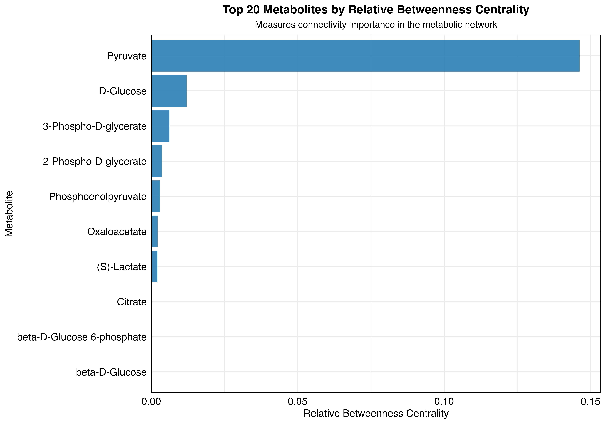
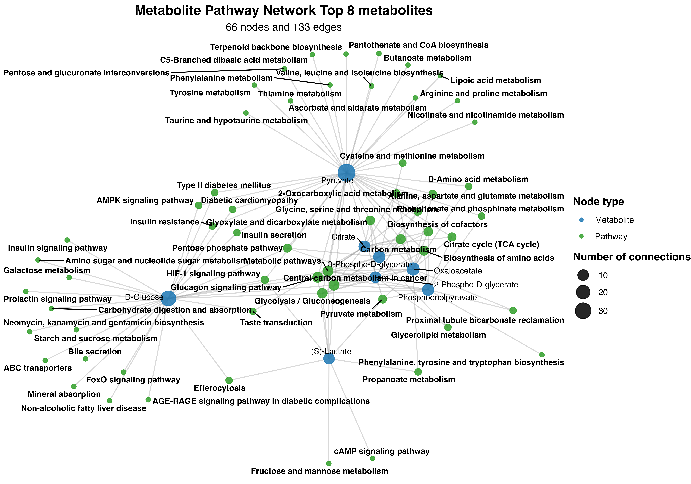
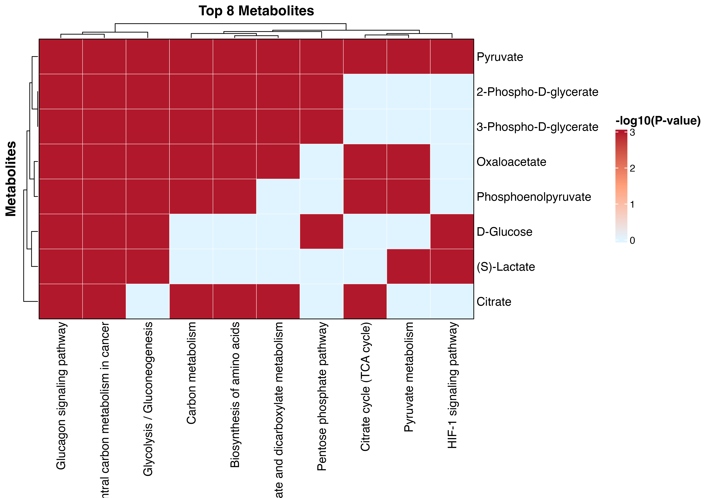
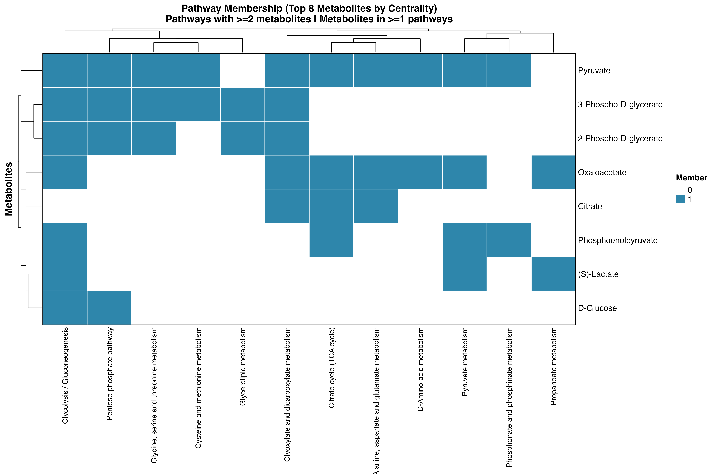
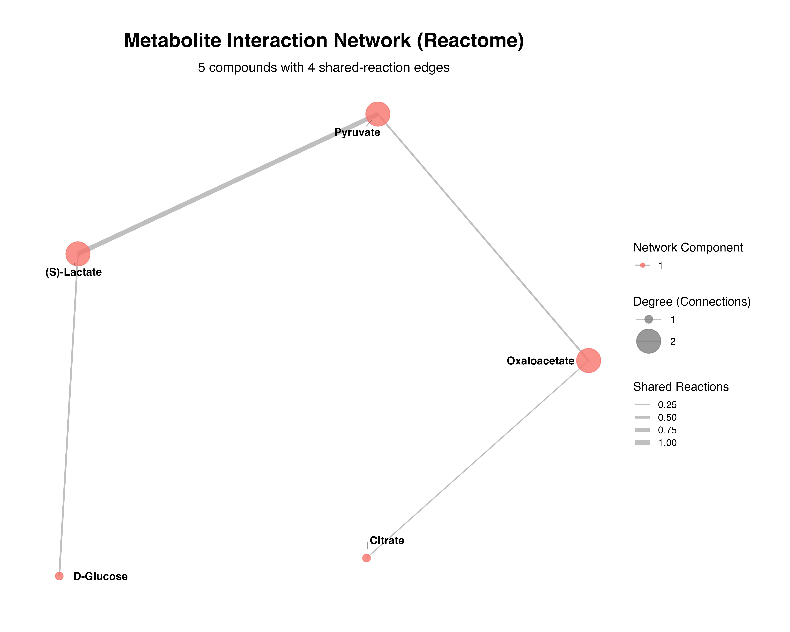

<!-- README.md is generated from README.Rmd. Please edit that file -->

# enrichmet

<!-- badges: start -->

<!-- badges: end -->

**enrichmet** simplifies local pathway enrichment analysis of
metabolomics data by allowing the complete workflow to be executed
through a single R function call. This design eliminates repetitive
steps such as data reformatting and parameter configuration, improving
efficiency, reducing the risk of errors, and supporting reproducible
analysis. For users who wish to run only a specific analysis or generate
selected plots rather than executing the full workflow, **enrichmet**
also provides dedicated modules for each individual analysis and
visualisation.

**enrichmet** performs pathway over-representation analysis using
Fisher’s exact test (optionally restricted to a measured background),
computes relative betweenness centrality for metabolites, and performs
Metabolite Set Enrichment Analysis (MetSEA) via **fgsea**. The
`enrichmet()` function produces three tables (S3 `data.frame` objects):
pathway enrichment results, MetSEA results, and metabolite centrality.
In addition, it generates eight plots (S3/S4 plot objects):

- **Pathway enrichment plot**
- **Pathway impact plot**
- **Metabolite Set Enrichment Analysis (MetSEA) plot**
- **Relative Betweenness Centrality (RBC) plot**
- **Pathway–metabolite network graph**
- **Pathway heatmap**
- **Pathway membership plot**
- **Reactome interaction network plot**

If differential analysis is run with `run_de()`, a volcano plot can also
be included.

## Installation

You can install **enrichmet** as:

``` r
if (!require("BiocManager", quietly = TRUE))
    install.packages("BiocManager")

BiocManager::install("enrichmet")
```

## Annotation data

Pathway and compound annotations are obtained at **runtime** from public
APIs (KEGG REST and Reactome mappings) and cached locally with
**BiocFileCache**. The package does **not** redistribute third-party
database dumps (KEGG, Reactome, or LION). Equivalent `Pathway` /
`Metabolites` tables can also be supplied by the user.

``` r
# Human pathway-to-metabolite map (KEGG organism code "hsa")
PathwayVsMetabolites <- fetch_kegg_pathway_metabolites(organism = "hsa")

# KEGG compound IDs and names, used when input_type = "name" or "mixed"
kegg_lookup <- fetch_kegg_compound_lookup()

# Reactome reaction mappings for the interaction network
kegg_ids <- extract_kegg_ids(PathwayVsMetabolites)
reactome_df <- fetch_kegg_reactome(kegg_ids = kegg_ids, species = "Homo sapiens")
```

## Input requirements

`enrichmet()` needs a **query set** of metabolites, supplied as either:

- `inputMetabolites`: a character vector of KEGG IDs and/or names,
  interpreted according to `input_type` (`"kegg"` (default), `"name"`,
  or `"mixed"`); or
- `da_results`: the output of `run_de()`, from which the query set is
  derived.

For MetSEA, or to build a measured-metabolite background, also provide
summary statistics (`example_data`) with the columns `met_id`, `pval` or
`padj`, and `log2fc`.

## Example

This is a basic example using human KEGG pathways:

``` r
# Load the enrichmet package
library(enrichmet)

# Retrieve annotations at runtime (cached with BiocFileCache)
PathwayVsMetabolites <- fetch_kegg_pathway_metabolites(organism = "hsa")
kegg_lookup <- fetch_kegg_compound_lookup()

# Example summary statistics
example_path <- get_cached_file(
  "https://zenodo.org/api/records/17819145/files/summary_stat.csv/content"
)
example_summary <- read.csv(example_path, stringsAsFactors = FALSE)

# Reactome reaction mappings
kegg_ids <- extract_kegg_ids(PathwayVsMetabolites)
reactome_df <- fetch_kegg_reactome(
  kegg_ids = kegg_ids,
  species = "Homo sapiens"
)

# Create example input metabolites (from example_summary)
inputMetabolites <- c(
  "C00031", "C00022", "C00197", "C00221", "C00631",
  "C01172", "C00074", "C00186", "C00036", "C00158"
)

# Run comprehensive enrichment analysis with ALL plot types
results <- enrichmet(
  inputMetabolites = inputMetabolites,
  PathwayVsMetabolites = PathwayVsMetabolites,
  example_data = example_summary,
  kegg_lookup = kegg_lookup,
  reactome_df = reactome_df,
  top_n = 10,
  p_value_cutoff = 1,
  analysis_type = c(
    "enrichment", "gsea", "centrality", "network",
    "heatmap", "membership", "interaction"
  ),
  network_top_n = 8,
  heatmap_top_n = 8,
  membership_top_n = 8,
  min_pathway_occurrence = 2,
  min_metabolite_occurrence = 1,
  input_type = "kegg"
)
```

### Results

``` r
cat("=== ENRICHMENT ANALYSIS RESULTS ===\n")
#> === ENRICHMENT ANALYSIS RESULTS ===
cat("Input metabolites used:",
    length(results$input_metabolites_used), "\n")
#> Input metabolites used: 10
cat("Pathways tested:",
    nrow(results$pathway_enrichment_all), "\n")
#> Pathways tested: 58
cat("Pathways reported (p <= cutoff):",
    nrow(results$pathway_enrichment_results), "\n")
#> Pathways reported (p <= cutoff): 10

cat("\n=== TOP 5 ENRICHED PATHWAYS ===\n")
#> 
#> === TOP 5 ENRICHED PATHWAYS ===
print(head(
  results$pathway_enrichment_results[
    , c("Pathway", "P_value", "Adjusted_P_value", "Enrichment_Ratio")
  ],
  5
))
#>                               Pathway      P_value Adjusted_P_value
#> 1          Glucagon signaling pathway 1.013715e-20     5.879546e-19
#> 2        Glycolysis / Gluconeogenesis 6.534351e-20     1.894962e-18
#> 3 Central carbon metabolism in cancer 2.917116e-16     5.639758e-15
#> 4                   Carbon metabolism 4.337350e-12     6.289157e-11
#> 5           Pentose phosphate pathway 3.189820e-11     3.700192e-10
#>   Enrichment_Ratio
#> 1        162.76154
#> 2        136.50968
#> 3        101.66486
#> 4         32.70957
#> 5         76.24865

cat("\n=== TOP 5 GSEA PATHWAYS ===\n")
#> 
#> === TOP 5 GSEA PATHWAYS ===
print(head(
  results$gsea_results[
    , c("pathway", "pval", "padj", "NES")
  ],
  5
))
#>                             pathway         pval        padj       NES
#>                              <char>        <num>       <num>     <num>
#> 1: Protein digestion and absorption 0.0001239302 0.008303321 -2.033918
#> 2:               Mineral absorption 0.0008590294 0.027873472 -1.912337
#> 3:      Biosynthesis of amino acids 0.0012480659 0.027873472 -1.802141
#> 4:      Aminoacyl-tRNA biosynthesis 0.0022928119 0.038404599 -1.877354
#> 5:        Biosynthesis of cofactors 0.0176549820 0.236576759 -1.579244

cat("\n=== TOP 5 CENTRAL METABOLITES ===\n")
#> 
#> === TOP 5 CENTRAL METABOLITES ===
print(head(
  results$metabolite_centrality[
    , c("Display_Name", "RBC_Metabolite")
  ],
  5
))
#>          Display_Name RBC_Metabolite
#> 1           D-Glucose   0.0078427493
#> 2            Pyruvate   0.0050064226
#> 3 Phosphoenolpyruvate   0.0008309704
#> 4        Oxaloacetate   0.0007228431
#> 5             Citrate   0.0005223189

# Display available plots
cat("\n=== AVAILABLE PLOTS ===\n")
#> 
#> === AVAILABLE PLOTS ===
available_plots <- names(results)[sapply(results, function(x) {
  any(class(x) %in% c("ggplot", "gg", "ggraph", "Heatmap", "HeatmapList"))
})]
cat("Plots generated:", paste(available_plots, collapse = ", "), "\n")
#> Plots generated: pathway_plot, impact_plot, gsea_plot, rbc_plot, network_plot, heatmap_plot, membership_plot, interaction_plot
```

### Visualisations

``` r
# Pathway enrichment (Fisher's exact test)
results$pathway_plot
```



``` r
# Pathway impact: significance vs. topology-based impact score
results$impact_plot
```



``` r
# MetSEA (fgsea)
results$gsea_plot
```



``` r
# Relative betweenness centrality of query metabolites
results$rbc_plot
```



``` r
# Pathway-metabolite network
results$network_plot
```



``` r
# Pathway heatmap
results$heatmap_plot
```



``` r
# Pathway membership
ComplexHeatmap::draw(results$membership_plot)
```



``` r
# Reactome-based metabolite interaction network
results$interaction_plot
```



## Background-corrected enrichment

Fisher’s exact test can be restricted to metabolites that were measured
(testable) in the experiment, reducing bias from database compounds that
were never observed.

``` r
measured_background <- extract_measured_kegg_ids(example_summary)

results_bg <- enrichmet(
  inputMetabolites = inputMetabolites,
  PathwayVsMetabolites = PathwayVsMetabolites,
  example_data = example_summary,
  kegg_lookup = kegg_lookup,
  reactome_df = reactome_df,
  backgroundMetabolites = measured_background,
  input_type = "kegg"
)
```

## Differential analysis followed by enrichment

For an end-to-end analysis that starts from the metabolomics matrix
(metabolites as rows, samples as columns), run differential analysis
with `run_de()` and pass the result to `enrichmet()` via `da_results`.
In this case `inputMetabolites` can be left `NULL`.

``` r
metabolomics_path <- get_cached_file(
  "https://zenodo.org/api/records/17819145/files/example_data.csv/content"
)
metabolomics_mat <- read.csv(
  metabolomics_path,
  row.names = 1,
  check.names = FALSE
)

da_out <- run_de(
  metabolomics_mat,
  "TK-CMV",
  "K-CMV",
  fc_threshold = 1,
  pval_threshold = 0.05
)

results_da <- enrichmet(
  inputMetabolites = NULL,
  PathwayVsMetabolites = PathwayVsMetabolites,
  da_results = da_out,
  example_data = example_summary,
  kegg_lookup = kegg_lookup,
  reactome_df = reactome_df
)
```

## Other pathway maps

The same over-representation interface accepts any pathway–feature table
in `Pathway` / `Metabolites` format, for example a lipid ontology map.
Lipid ontology content is not shipped with the package; users may supply
their own map or obtain ontology terms under the terms of the LION
project or BioPortal.

## Data sources

- Kanehisa, M., et al. (2025). KEGG: biological systems database as a
  model of the real world. *Nucleic Acids Research*, 53, D672–D677.
  <https://www.kegg.jp/>
- Milacic, M., et al. (2024). The Reactome Pathway Knowledgebase 2024.
  *Nucleic Acids Research*, 52(D1), D672–D678. <https://reactome.org/>
- Molenaar, M. R., et al. (2019). LION/web: a web-based ontology
  enrichment tool for lipidomic data analysis. *GigaScience*, 8(6),
  giz061. <http://www.lipidontology.com/>
