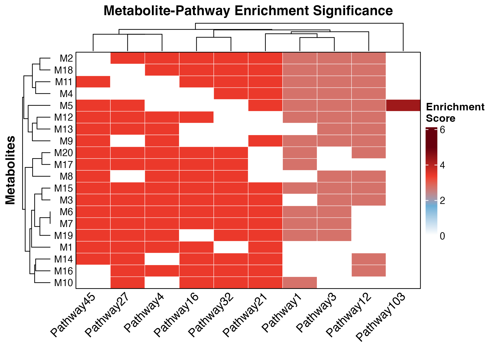

<!-- README.md is generated from README.Rmd. Please edit that file -->

# enrichmet

<!-- badges: start -->
<!-- badges: end -->

**enrichmet** streamlines pathway enrichment analysis by enabling the
entire workflow through a single R function call. This approach reduces
repetitive tasks such as data formatting and parameter setup, helping
users save time, minimize errors, and achieve more reproducible results.

**enrichmet** performs pathway enrichment analysis using Fisher’s exact
test, computes betweenness centrality for metabolites, and performs
Metabolite Set Enrichment Analysis (MetSEA). The **enrichmet**()
function produces three tables (S3 data.frame objects), which may
include the MetSEA table, metabolite centrality, and pathway enrichment
results. In addition, it generates eight plots (S3/S4 plot objects):

- **Pathway enrichment plot**
- **Pathway impact plot**
- **MetSEA plot**
- **RBC plot**
- **Network graph**
- **Pathway heatmap**
- **Pathway membership plot**
- **Interaction network plot**

## Installation

You can install enrichmet as:

``` r
install.packages("remotes")
remotes::install_git("https://github.com/biodatalab/enrichmet.git")
or 
install.packages("devtools")
devtools::install_git("https://github.com/biodatalab/enrichmet.git")
or
if (!require("BiocManager", quietly = TRUE))
    install.packages("BiocManager")
BiocManager::install("enrichmet")
```

## Example

This is a basic example

``` r
library(enrichmet)
library(dplyr)
library(stringr)

## basic example code
## ** Examples

# Generate example data with at least n=50 metabolites
set.seed(1234)

# Create 20 unique metabolites
inputMetabolites <- paste0("M", 1:20)

# ---- 1. Generate 50 pathways with random metabolites assigned ----
pathway_names <- paste0("Pathway", 1:50)
PathwayVsMetabolites <- data.frame(
  Pathway = rep(pathway_names, each = 1),
  Metabolites = sapply(1:50, function(x) paste(sample(inputMetabolites, sample(5:15, 1)), collapse = ","))
)

# ---- 2. Add new pathway entries ----
new_rows <- data.frame(
  Pathway = c("Pathway101", "Pathway102", "Pathway103", "Pathway104", "Pathway105"),
  Metabolites = c(
    "M12,M13,M14,M15,M16,M1,M18,M3,M6,M16,M4",
    "M6,M7,M8,M9,M10,M11,M9,M6,M16,M4",
    "M24,M25,M26,M27,M28,M29,M30,M26,M5",
    "M13,M14,M15,M16,M17,M24,M27,M14",
    "M15,M16,M17,M18,M19,M20,M21,M4,M8,M10"
  )
)

# Combine with existing PathwayVsMetabolites
PathwayVsMetabolites <- rbind(PathwayVsMetabolites, new_rows)

# ---- 3. Generate example metabolite-level data ----
example_data <- data.frame(
  met_id = inputMetabolites,
  pval = runif(20, 0.001, 0.05),  # Random p-values between 0.001 and 0.05
  log2fc = rnorm(20, mean = 0, sd = 1)  # Log2 fold changes from normal distribution
)

# ---- 4. Create mapping_df ----
set.seed(42)
mapping_df <- data.frame(
  KEGG_ID = inputMetabolites,
  PubChem_CID = as.character(sample(10000:99999, length(inputMetabolites))),
  STITCH_ID = paste0("CIDs", stringr::str_pad(sample(1000:9999, length(inputMetabolites)), 8, pad = "0"))
)

# ---- 5. Create synthetic STITCH interaction data ----
stitch_ids <- mapping_df$STITCH_ID

stitch_pairs <- expand.grid(chemical1 = stitch_ids, chemical2 = stitch_ids) %>%
  dplyr::filter(chemical1 != chemical2)

set.seed(123)
stitch_df <- stitch_pairs %>%
  dplyr::slice_sample(n = 200) %>%
  dplyr::mutate(
    similarity = runif(dplyr::n(), 0, 1),
    experimental = sample(0:500, dplyr::n(), replace = TRUE),
    database = sample(c(0, 300, 600, 900), dplyr::n(), replace = TRUE),
    textmining = sample(0:1000, dplyr::n(), replace = TRUE),
    combined_score = similarity * 200 + experimental + database + textmining
  )

# ---- 6. Run enrichment analysis ----
results <- enrichmet(
  inputMetabolites = inputMetabolites,
  PathwayVsMetabolites = PathwayVsMetabolites, 
  example_data = example_data,
  top_n = 10,
  mapping_df = mapping_df,
  stitch_df = stitch_df
)
#> Running pathway enrichment analysis...
#> Running GSEA analysis...
#>   |                                                                                                    |                                                                                            |   0%  |                                                                                                    |============================================================================================| 100%
#> Running centrality analysis...
#> Generating metabolite-pathway network visualization...
#> Generating enrichment heatmap...
#> Generating pathway membership plot...
#> Generating STITCH interaction network...

# Display the results
print(results)
#> $pathway_enrichment_results
#>       Pathway      P_value Log_P_value   Impact  Coverage Count Adjusted_P_value      Q_value
#> 1  Pathway103 5.180005e-05    4.285670 0.967574 0.1111111     1      0.002849003 0.0008314444
#> 2    Pathway4 4.140787e-04    3.382917 1.000000 1.0000000    15      0.003253475 0.0009494845
#> 3   Pathway16 4.140787e-04    3.382917 1.000000 1.0000000    15      0.003253475 0.0009494845
#> 4   Pathway21 4.140787e-04    3.382917 1.000000 1.0000000    15      0.003253475 0.0009494845
#> 5   Pathway27 4.140787e-04    3.382917 1.000000 1.0000000    15      0.003253475 0.0009494845
#> 6   Pathway32 4.140787e-04    3.382917 1.000000 1.0000000    15      0.003253475 0.0009494845
#> 7   Pathway45 4.140787e-04    3.382917 1.000000 1.0000000    15      0.003253475 0.0009494845
#> 8    Pathway1 1.932367e-03    2.713910 1.000000 1.0000000    14      0.007591442 0.0022154637
#> 9    Pathway3 1.932367e-03    2.713910 1.000000 1.0000000    14      0.007591442 0.0022154637
#> 10  Pathway12 1.932367e-03    2.713910 1.000000 1.0000000    14      0.007591442 0.0022154637
#> 
#> $pathway_plot
```


    #> 
    #> $impact_plot


    #> 
    #> $gsea_results
    #>        pathway       pval      padj    log2err         ES        NES  size  leadingEdge input_count
    #>         <char>      <num>     <num>      <num>      <num>      <num> <int>       <list>       <int>
    #>  1:  Pathway44 0.01654838 0.4633546 0.35248786  0.6614587  1.8400572    12 M10, M8,....          11
    #>  2:  Pathway16 0.06215722 0.6995734 0.24504179  0.6043675  1.5035499    15 M10, M8,....          12
    #>  3:   Pathway4 0.07495430 0.6995734 0.22205605  0.6000000  1.4926845    15 M8, M18,....          15
    #>  4:   Pathway5 0.15118397 0.8268206 0.15214492  0.4701742  1.3256460    10 M10, M8,....           6
    #>  5:  Pathway14 0.17045455 0.8268206 0.16080140 -0.5000000 -1.3155390    14 M4, M14,....          14
    #>  6:  Pathway40 0.22538293 0.8268206 0.13500203 -0.4000000 -1.1849029    10 M11, M13....          10
    #>  7:  Pathway50 0.22768670 0.8268206 0.12098514  0.4308735  1.2148386    10 M10, M18....           5
    #>  8:   Pathway3 0.23623446 0.8268206 0.11673920  0.4748511  1.2181004    14 M8, M18,....           9
    #>  9:  Pathway10 0.31567329 0.8649059 0.11191832 -0.3976401 -1.1101883    13 M14, M11....          11
    #> 10:  Pathway31 0.32891832 0.8649059 0.10925004 -0.3913365 -1.0925890    13 M4, M14,....           5
    #> 11:   Pathway6 0.36297641 0.8649059 0.09139243  0.4125680  1.1040587    13 M8, M18,....           7
    #> 12:  Pathway49 0.42095915 0.8649059 0.08197788  0.4035665  1.0352394    14 M10, M8,....          13
    #> 13:   Pathway8 0.46265938 0.8649059 0.07829552  0.3569015  1.0062762    10 M10, M18....           4
    #> 14:  Pathway20 0.50273224 0.8649059 0.07399014  0.3439208  0.9696775    10 M8, M18,....           4
    #> 15:  Pathway46 0.52735230 0.8649059 0.08108021 -0.3108579 -0.9208409    10 M4, M11,....           5
    #> 16:  Pathway29 0.53463588 0.8649059 0.06961334  0.3661688  0.9393059    14 M10, M18....           7
    #> 17:  Pathway27 0.61791590 0.8649059 0.06392719  0.3422868  0.8515438    15 M10, M5,....          11
    #> 18:  Pathway38 0.63261649 0.8649059 0.06184060  0.2997855  0.8452678    11 M10, M8,....           4
    #> 19:  Pathway37 0.65154265 0.8649059 0.06103637  0.3004564  0.8040408    13 M10, M8, M18           3
    #> 20:  Pathway42 0.67741935 0.8649059 0.05859376  0.2880006  0.8120397    11 M10, M18....           5
    #> 21:  Pathway12 0.68181818 0.8649059 0.06977925 -0.3170869 -0.8342802    14 M4, M14,....           4
    #> 22:  Pathway45 0.70897155 0.8649059 0.06598161 -0.3207094 -0.8072967    15 M14, M11....          14
    #> 23:   Pathway1 0.73534636 0.8649059 0.05434344  0.3073623  0.7884538    14 M10, M18....           6
    #> 24:  Pathway41 0.74134791 0.8649059 0.05513518  0.2687502  0.7577354    10 M10, M18, M5           3
    #> 25: Pathway101 0.77680525 0.8700219 0.06157068 -0.2454347 -0.7270408    10      M4, M14           2
    #> 26:  Pathway32 0.85923218 0.9253270 0.04850598  0.2639557  0.6566709    15 M10, M8,....          10
    #> 27:  Pathway21 0.93654267 0.9712294 0.05280500 -0.2251422 -0.5667330    15 M4, M14, M11           3
    #> 28:  Pathway33 0.97272727 0.9727273 0.05280500 -0.1901906 -0.5004062    14 M4, M14,....          10
    #>        pathway       pval      padj    log2err         ES        NES  size  leadingEdge input_count
    #> 
    #> $gsea_plot


    #> 
    #> $metabolite_centrality
    #>     Metabolite RBC_Metabolite Display_Name
    #> M5          M5     0.15714273           M5
    #> M15        M15     0.05131805          M15
    #> M13        M13     0.04712690          M13
    #> M4          M4     0.04672274           M4
    #> M17        M17     0.04616655          M17
    #> M14        M14     0.04387685          M14
    #> M16        M16     0.04104349          M16
    #> M6          M6     0.04095280           M6
    #> M18        M18     0.04072780          M18
    #> M20        M20     0.03805627          M20
    #> M10        M10     0.03760958          M10
    #> M7          M7     0.03553040           M7
    #> M3          M3     0.03479436           M3
    #> M11        M11     0.03091444          M11
    #> M19        M19     0.02765930          M19
    #> M8          M8     0.02734310           M8
    #> M12        M12     0.02359517          M12
    #> M9          M9     0.02218647           M9
    #> M1          M1     0.02070698           M1
    #> M2          M2     0.01865809           M2
    #> 
    #> $rbc_plot


    #> 
    #> $network_plot


    #> 
    #> $heatmap_plot



    #> 
    #> $membership_plot


    #> 
    #> $interaction_plot


