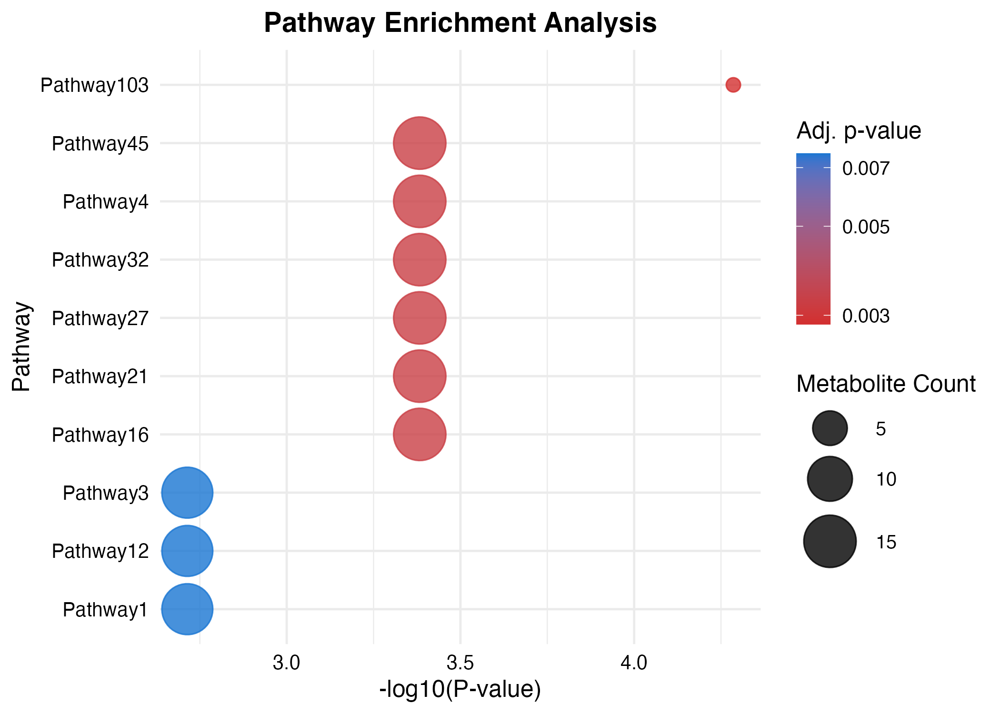
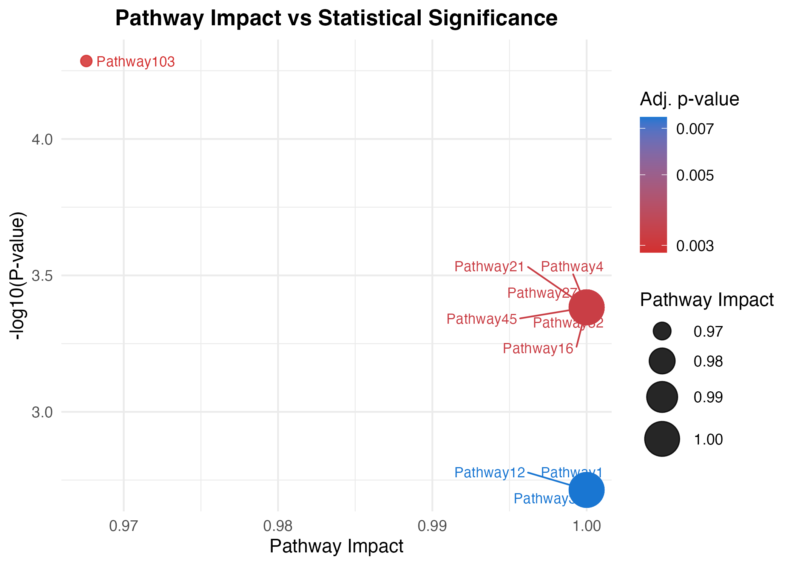
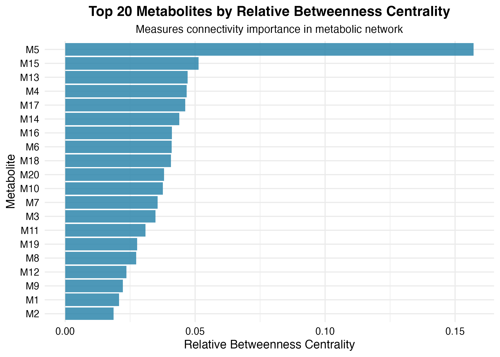
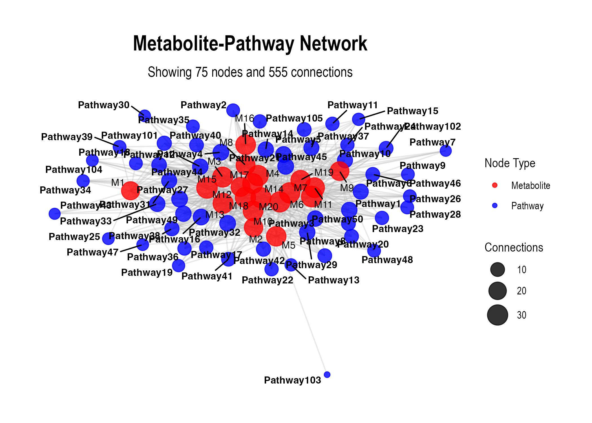
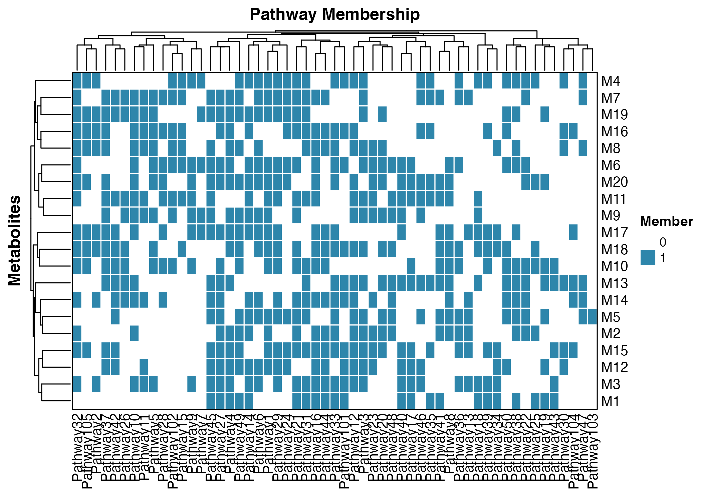

<!-- README.md is generated from README.Rmd. Please edit that file -->

# enrichmet

<!-- badges: start -->
<!-- badges: end -->

enrichmet performs pathway enrichment analysis using Fisher’s exact
test, computes betweenness centrality for metabolites, and performs
Metabolite Set Enrichment Analysis (MetSEA). It also generates plots for
pathway enrichment, MetSEA, relative betweenness centrality (RBC), and  and interaction plot.

## Installation

You can install enrichmet as:

``` r
install.packages("remotes")
remotes::install_git("https://github.com/biodatalab/enrichmet.git")
or 
install.packages("devtools")
devtools::install_git("https://github.com/biodatalab/enrichmet.git")
or
if (!require("BiocManager", quietly = TRUE))
    install.packages("BiocManager")
BiocManager::install("enrichmet")
```

## Example

This is a basic example

``` r
  library(igraph)
#> 
#> Attaching package: 'igraph'
#> The following objects are masked from 'package:stats':
#> 
#>     decompose, spectrum
#> The following object is masked from 'package:base':
#> 
#>     union
  library(ggraph)
#> Loading required package: ggplot2
  library(tidygraph)
#> 
#> Attaching package: 'tidygraph'
#> The following object is masked from 'package:igraph':
#> 
#>     groups
#> The following object is masked from 'package:stats':
#> 
#>     filter
  library(ggplot2)
  library(openxlsx)
  library(dplyr)
#> 
#> Attaching package: 'dplyr'
#> The following objects are masked from 'package:igraph':
#> 
#>     as_data_frame, groups, union
#> The following objects are masked from 'package:stats':
#> 
#>     filter, lag
#> The following objects are masked from 'package:base':
#> 
#>     intersect, setdiff, setequal, union
  library(tidyr)
#> 
#> Attaching package: 'tidyr'
#> The following object is masked from 'package:igraph':
#> 
#>     crossing
  library(fgsea)
  library(purrr)
#> 
#> Attaching package: 'purrr'
#> The following objects are masked from 'package:igraph':
#> 
#>     compose, simplify
  library(ggrepel)
  library(stringr)
  library(pheatmap)
  library(ComplexHeatmap)
#> Loading required package: grid
#> ========================================
#> ComplexHeatmap version 2.24.0
#> Bioconductor page: http://bioconductor.org/packages/ComplexHeatmap/
#> Github page: https://github.com/jokergoo/ComplexHeatmap
#> Documentation: http://jokergoo.github.io/ComplexHeatmap-reference
#> 
#> If you use it in published research, please cite either one:
#> - Gu, Z. Complex Heatmap Visualization. iMeta 2022.
#> - Gu, Z. Complex heatmaps reveal patterns and correlations in multidimensional 
#>     genomic data. Bioinformatics 2016.
#> 
#> 
#> The new InteractiveComplexHeatmap package can directly export static 
#> complex heatmaps into an interactive Shiny app with zero effort. Have a try!
#> 
#> This message can be suppressed by:
#>   suppressPackageStartupMessages(library(ComplexHeatmap))
#> ========================================
#> ! pheatmap() has been masked by ComplexHeatmap::pheatmap(). Most of the arguments
#>    in the original pheatmap() are identically supported in the new function. You 
#>    can still use the original function by explicitly calling pheatmap::pheatmap().
#> 
#> Attaching package: 'ComplexHeatmap'
#> The following object is masked from 'package:pheatmap':
#> 
#>     pheatmap
  library(ggplotify)
  library(enrichmet)
## basic example code
## ** Examples

# Generate example data with at least n=50 metabolites
set.seed(1234)

# Create 50 unique metabolites
inputMetabolites <- paste0("M", 1:20)

# ---- 1. Generate 10 pathways with random metabolites assigned ----
pathway_names <- paste0("Pathway", 1:50)
PathwayVsMetabolites <- data.frame(
  Pathway = rep(pathway_names, each = 1),
  Metabolites = sapply(1:50, function(x) paste(sample(inputMetabolites, sample(5:15, 1)), collapse = ","))
)

# ---- 2. Add new pathway entries (Pathway101 and Pathway102) ----
new_rows <- data.frame(
  Pathway = c("Pathway101", "Pathway102", "Pathway103", "Pathway104", "pathway105"),
  Metabolites = c(
    "M12,M13,M14,M15,M16,M1,M18,M3,M29,M6,M16,M4",
    "M6,M7,M8,M9,M10,M11,M9,M29,M6,M6,M16,M4",
    "M24,M25,M26,M27,M28,M29,M30,M29,M26,M5",
    "M13,M14,M15,M16,M17,M24,M27,M14",
    "M15,M16,M17,M18,M19,M20,M21,M4,M8,M10"
    
  )
)

# Combine with existing PathwayVsMetabolites
PathwayVsMetabolites <- rbind(PathwayVsMetabolites, new_rows)

# ---- 3. Generate example metabolite-level data ----
example_data <- data.frame(
  met_id = inputMetabolites,
  pval = runif(20, 0.001, 0.05),  # Random p-values between 0.001 and 0.05
  log2fc = rnorm(20, mean = 0, sd = 1)  # Log2 fold changes from normal distribution
)

# ---- 4. Create mapping_df ----
set.seed(42)
mapping_df <- data.frame(
  KEGG_ID = inputMetabolites,
  PubChem_CID = as.character(sample(10000:99999, length(inputMetabolites))),
  STITCH_ID = paste0("CIDs", str_pad(sample(1000:9999, length(inputMetabolites)), 8, pad = "0"))
)

# ---- 5. Create synthetic STITCH interaction data ----
stitch_ids <- mapping_df$STITCH_ID

stitch_pairs <- expand.grid(chemical1 = stitch_ids, chemical2 = stitch_ids) %>%
  filter(chemical1 != chemical2)

set.seed(123)
stitch_df <- stitch_pairs %>%
  slice_sample(n = 200) %>%
  mutate(
    similarity = runif(n(), 0, 1),
    experimental = sample(0:500, n(), replace = TRUE),
    database = sample(c(0, 300, 600, 900), n(), replace = TRUE),
    textmining = sample(0:1000, n(), replace = TRUE),
    combined_score = similarity * 200 + experimental + database + textmining
  ) %>%
  as_tibble()

# ---- 6. Run enrichment analysis ----
enrichmet(
  inputMetabolites = inputMetabolites,
  PathwayVsMetabolites = PathwayVsMetabolites, example_data,
  top_n = 20,
  mapping_df = mapping_df,
  stitch_df = stitch_df
)
#>   |                                                                              |                                                                      |   0%  |                                                                              |======================================================================| 100%
#> $pathway_plot
```



    #> 
    #> $impact_plot



    #> 
    #> $gsea_plot


    #> 
    #> $rbc_plot



    #> 
    #> $network_plot
    #> Warning: Removed 55 rows containing missing values or values outside the scale range
    #> (`geom_point()`).



    #> 
    #> $heatmap_plot


    #> 
    #> $membership_plot



    #> 
    #> $interaction_plot


# enrichmet
